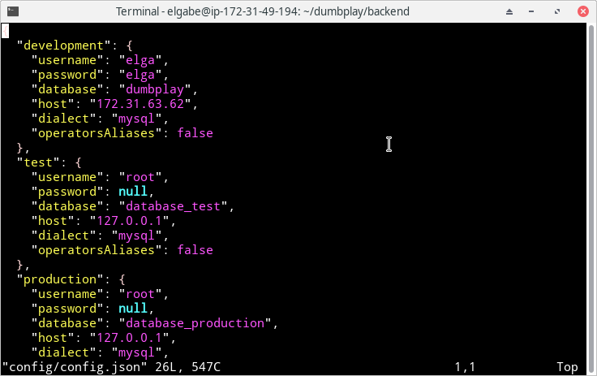
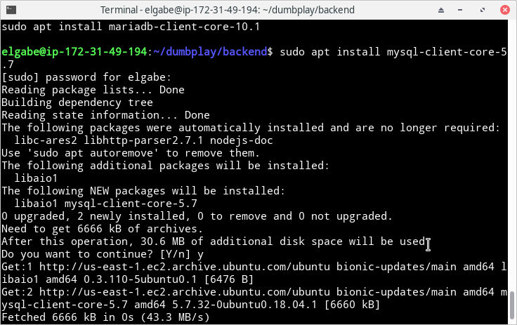
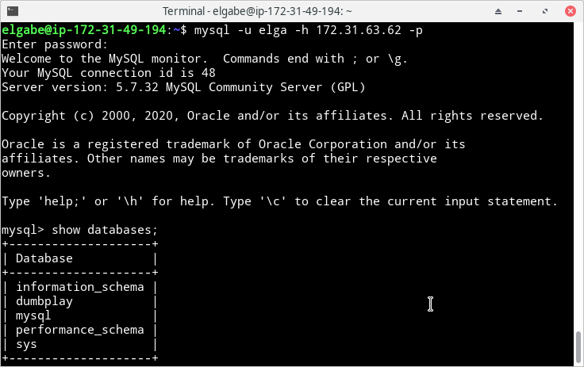
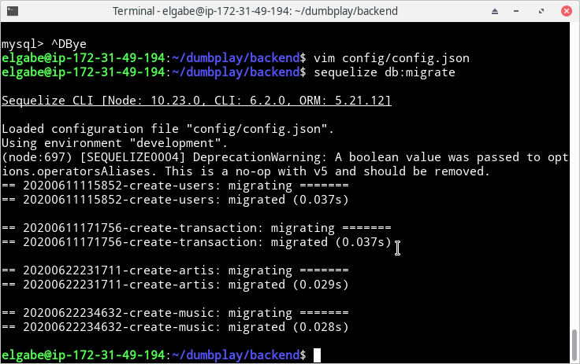
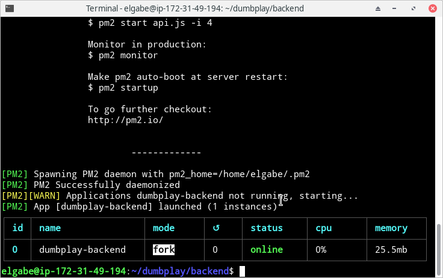

# DEPLOYMENT BACKEND

- Clone repo dumbplay dengan perintah `git clone git@github.com:frostmarry/dumbplay.git` dan masuk ke directory backend lalu jalankan perintah `npm install`

- instal library pendukung seperti nodejs, npm dan pm2 seperti [minggu pertama](../../dumbweek1) ditambah instal sequelize dengan perintah `sudo npm install -g sequelize-cli` untuk migrasi database

- Edit file config.json pada directory `dumbplay/backend/config/` dan isi username, password serta host sesuai seperti yang sudah dibuat pada sesi `instalasi database` 

- Sebelum melakukan migrasi, saya mencoba dulu masuk ke mysql pada server database dengan menginstall mysql-client untuk mysql versi 5.7

- Masuk ke mysql server database dengan perintah `mysql -u 'username' -h 'ip-server-db' -p` dan coba lihat database yang ada dengan perintah `show databases; `

- Jalankan migrasi database dengan perintah `sequelize db:migrate` , pastikan berada pada directory `dumbplay/backend`

- Aktifkan pm2 untuk backend agar nodejs terus berjalan walaupun ssh terputus

