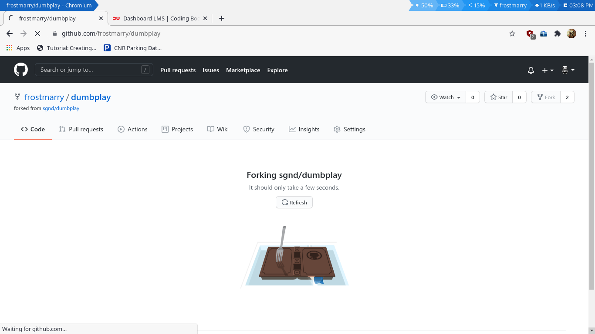
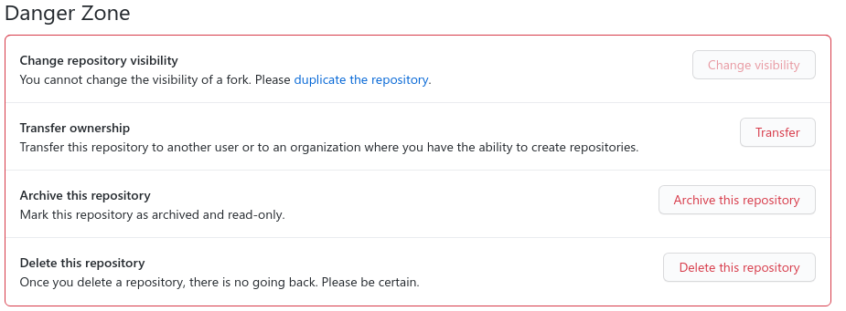
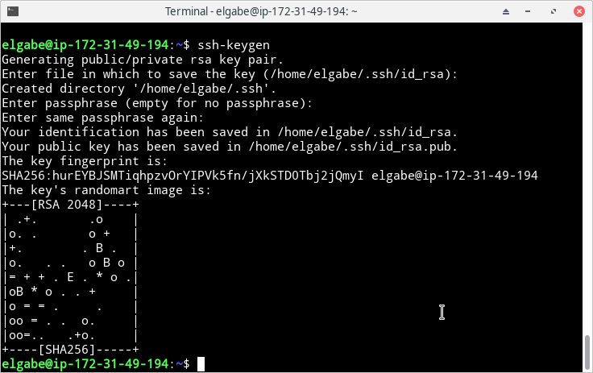
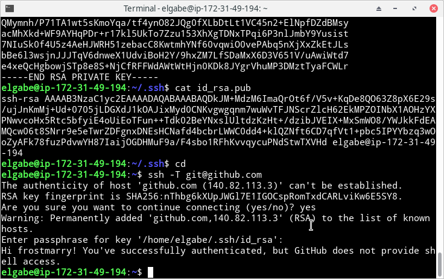
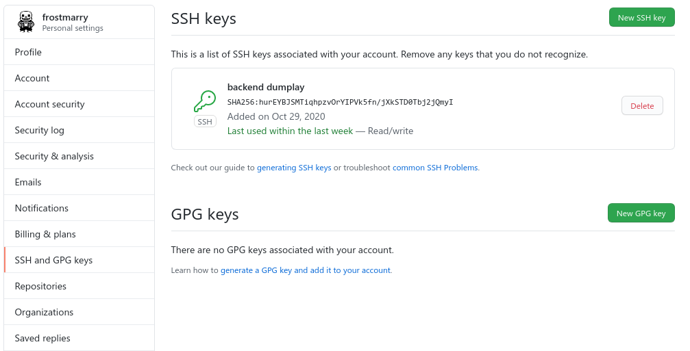
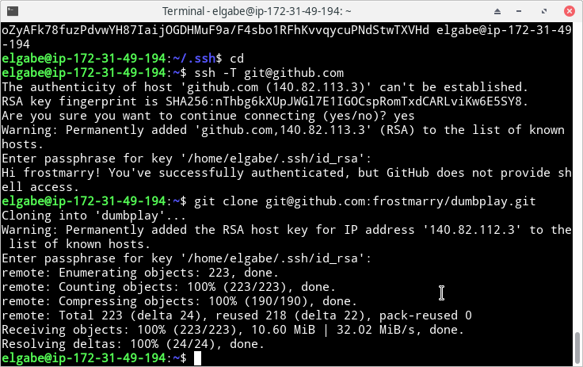
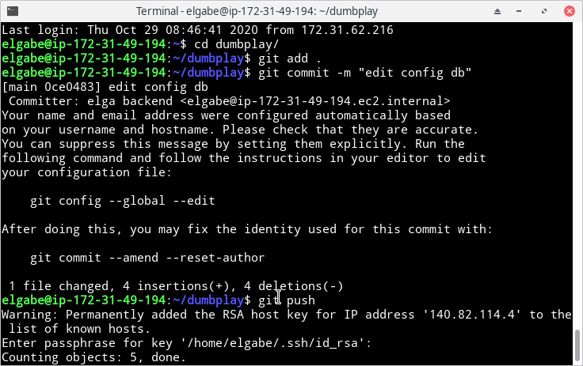

# INSTALL GIT AND SSH KEY

- Fork repository dumbplay milik mas sugeng, sehingga saya mendapat salinan repository tersebut tanpa perlu mengcopy secara manual, setelah berhasil duplikat repo yang sudah didapat dan jadikan private repository




- Buat SSH keygen dengan perintah `ssh-keygen` dan ikuti perintah selanjutnya.



- Lihat isi file id_rsa.pub yang berisikan ssh key yang akan digunakan dengan perintah `cat id_rsa.pub`, kemudian tambahkan ke akun github, lalu jalankan perintah `ssh -T git@github.com` untuk menghubungkan komputer dengan akun github yang sudah terisi SSH. 




- Jalankan perintah `git clone git@github.com:frostmarry/dumbplay.git` untuk ujicoba mengambil repository private dari akun github, lalu copy file .env-copy ke .env dan jalankan perintah 
```
git add . 
gt commit -m "" 
git push
```


