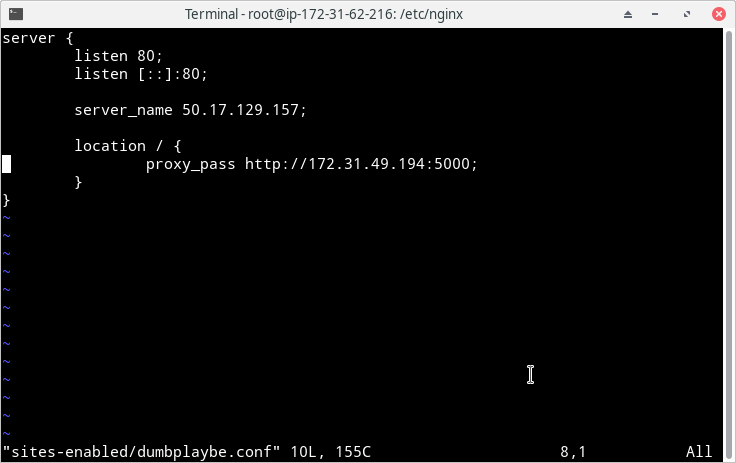
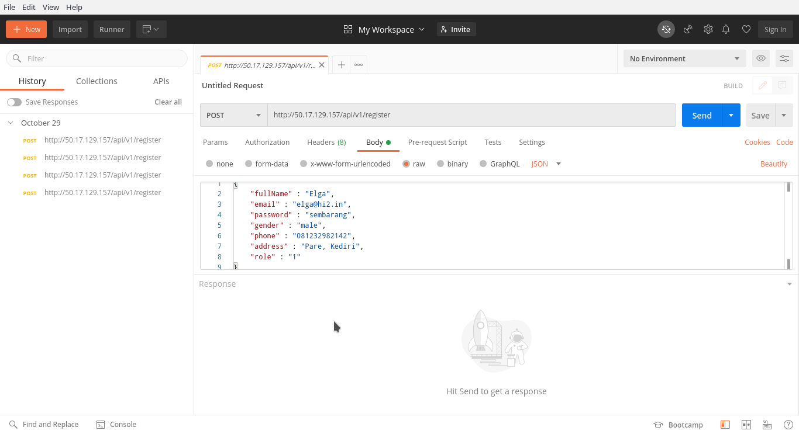
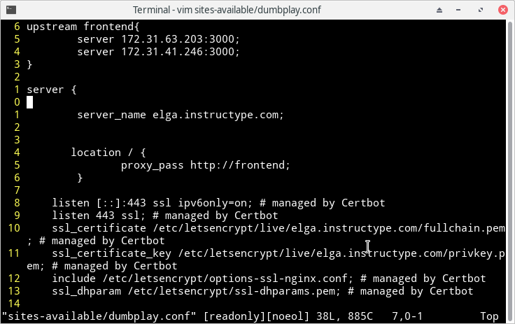

# REVERSE PROXY

- Buat file baru bernama `dumbplaybe.conf` dan masukkan konfigurasi seperti berikut

PS: konfigurasi bisa dilakukan pada 1 file saja dan digabungkan dengan konfigurasi frontend, tapi menurut saya jika dipisah akan jauh lebih mudah untuk melakukan debugging bila ada suatu kesalahan

- Tambah user baru untuk mengakses https://elga.instructype.com dari api backend melalui postman 

- Pada Reverse proxy frontend saya tambahkan upstream untuk loadbalancing, sehingga jika 1 server frontend mati maka server yang lain bisa langsung menggantikan 

