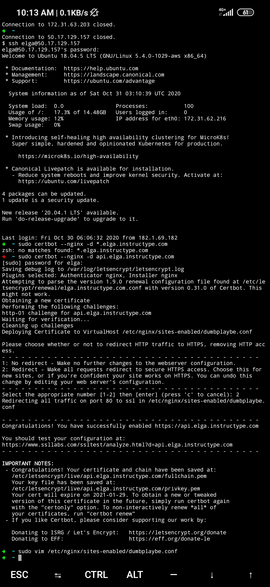
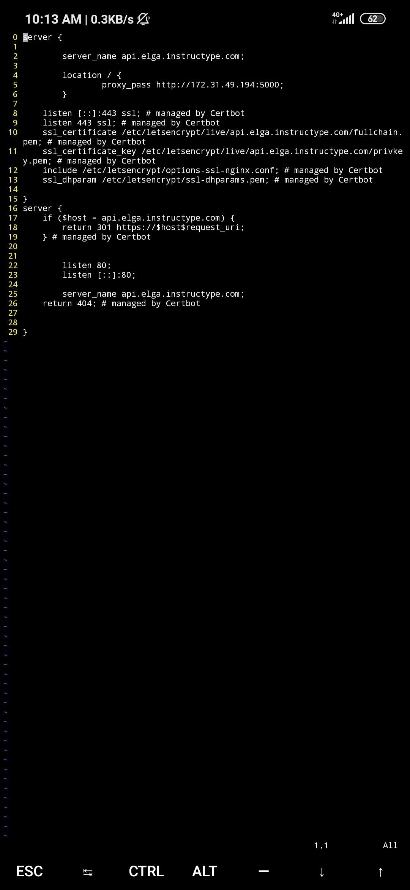
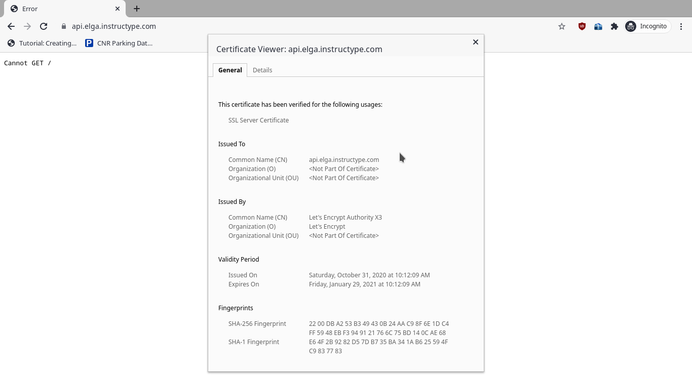
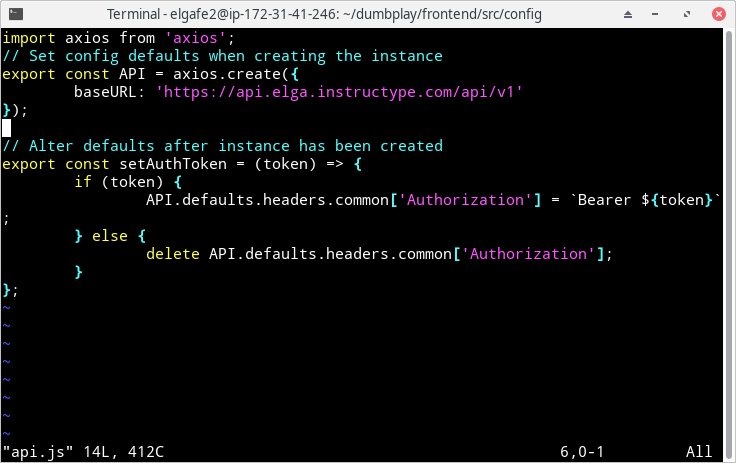
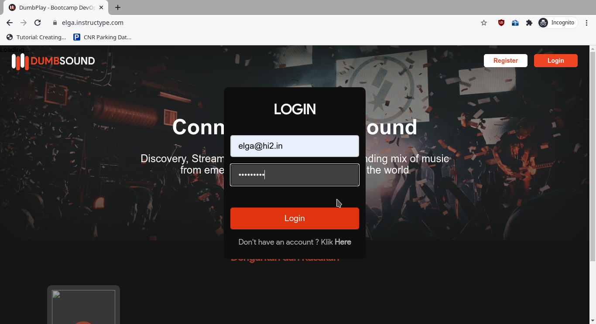
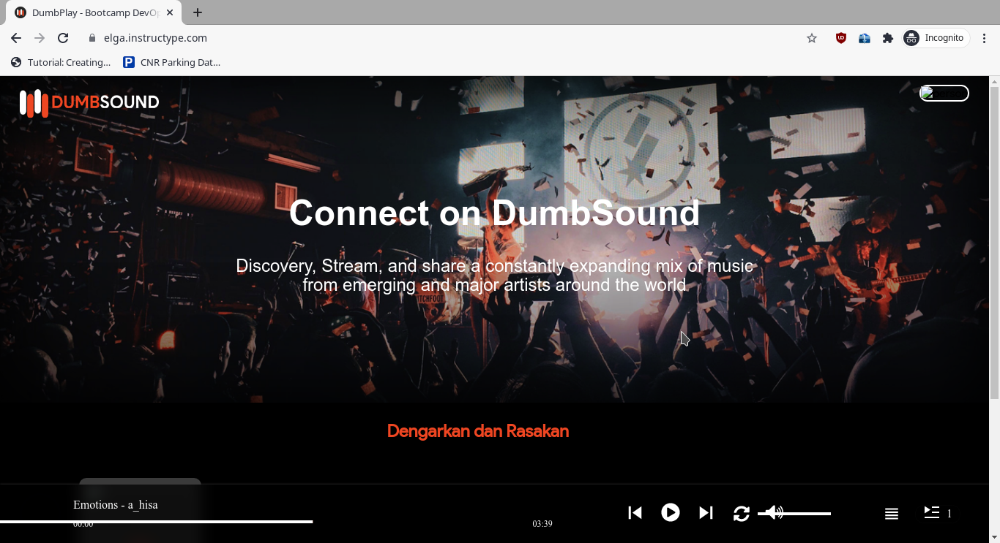

# SSL CONFIGURATION

- Karena pada server public saya sudah ada certbot, maka saya hanya perlu mengaktifkan let's encrypt pada server backend melalui certbot seperti saat saya mengaktifkan SSL pada server frontend.

- Tes akses ke website https://api.elga.instructype.com dan cek SSl certificate

- Ubah configurasi api pada server frontend dalam directory `dumbplay/frontend/src/config/` 

- Tes login dari https://elga.instructype.com menggunakan user yang sudah ditambahkan saat proses `reverse proxy backend`

