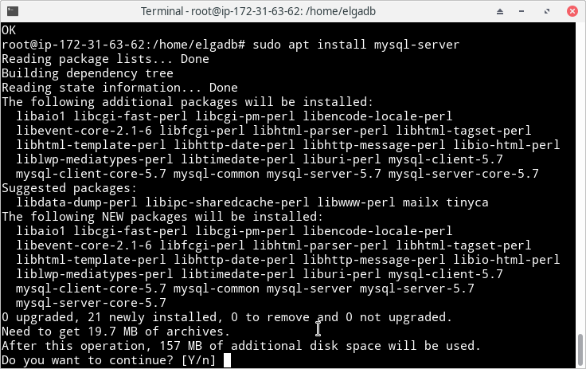
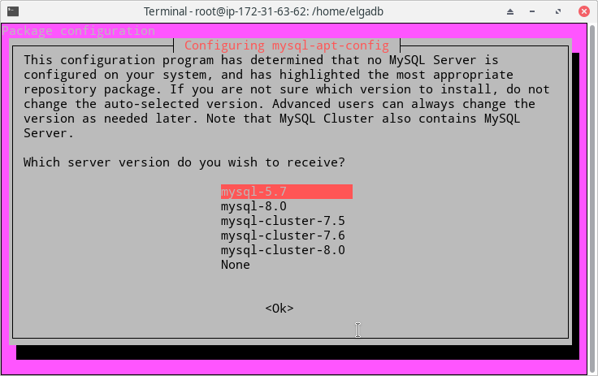
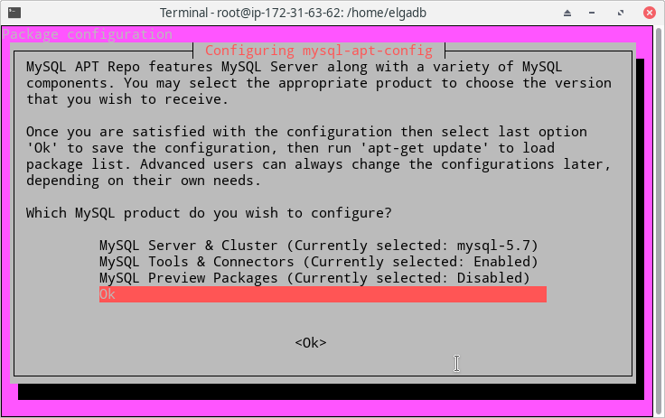
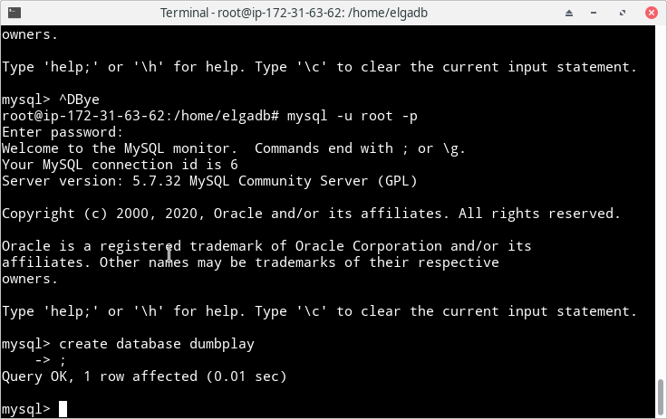
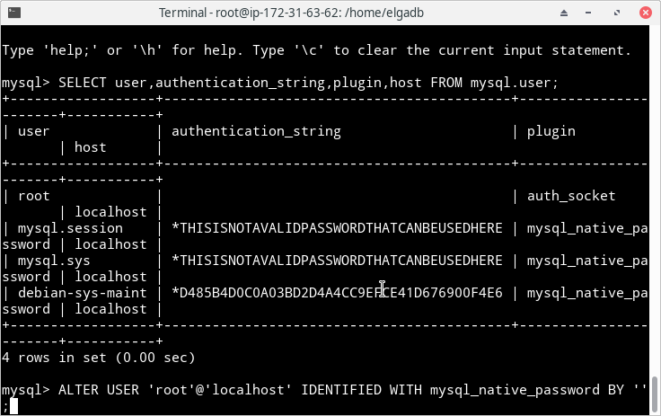
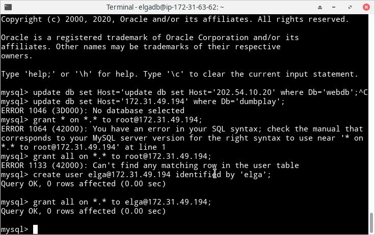
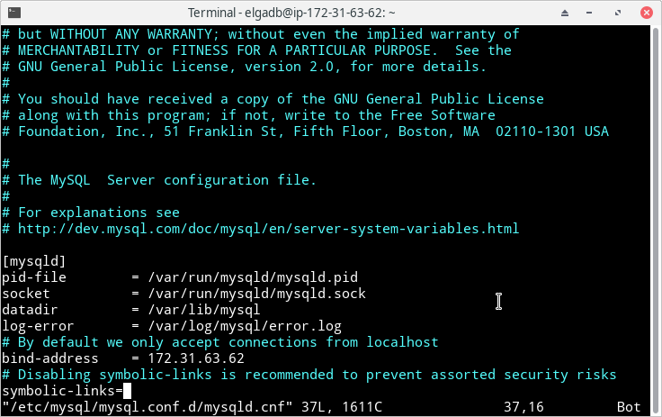

# Setup Database

- Instal mysql pada server database dengan perintah `sudo apt install mysql-server` dan pilih mysql versi 5.7





- Dalam proses instalasi mysql lewat apt, saya tidak diberi kesempatan untuk membuat user baru, jadi user default sudah ada root dan tanpa password, untuk menambahkan user baru perlu masuk dahulu ke mysql dan menjalankan perintah :

``` ALTER USER 'root'@'localhost' IDENTIFIED WITH mysql_native_password BY 'passwordbaru' ```



- Setelah password root diganti, coba relogin ke mysql dengan password baru, setelah berhasil buat database baru bernama `dumbplay` 



- Buat user baru untuk mengakses server database dari server backend dan beri akses penuh dengan perintah :

```
create user 'namauser'@'ip-server-backend' identified by 'password'; 

grant all on *.* to 'namauser'@'ip-server-backend';

FLUSH PRIVILEGES;
```



- Ubah bind-address yang ada pada file mysqld.cnf pada directory `/etc/mysql/mysql.conf.d/` dengan ip private server database


