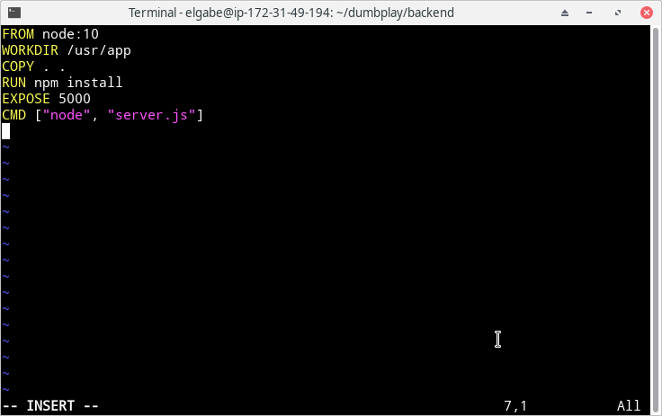
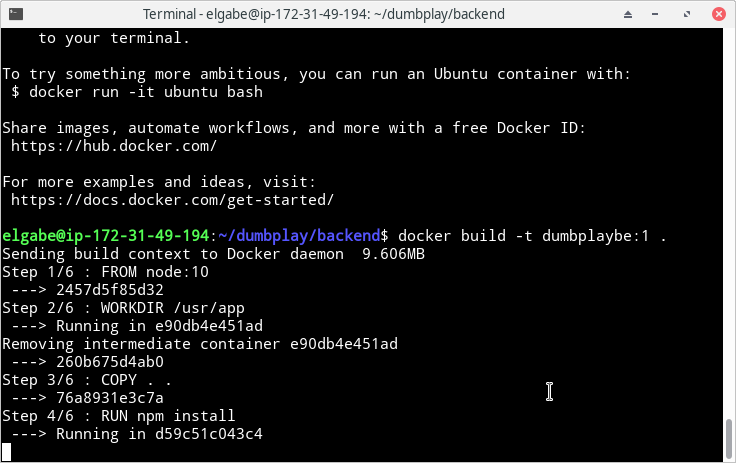
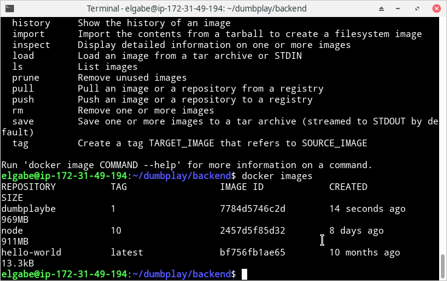
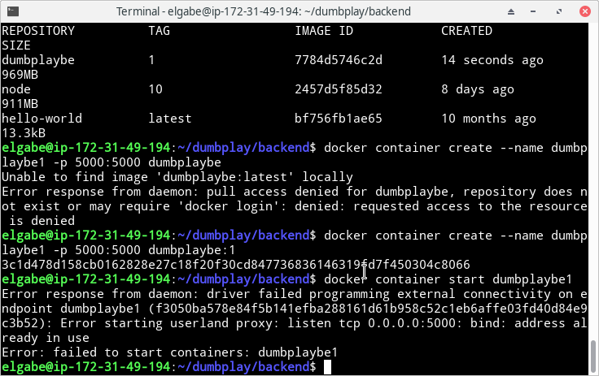
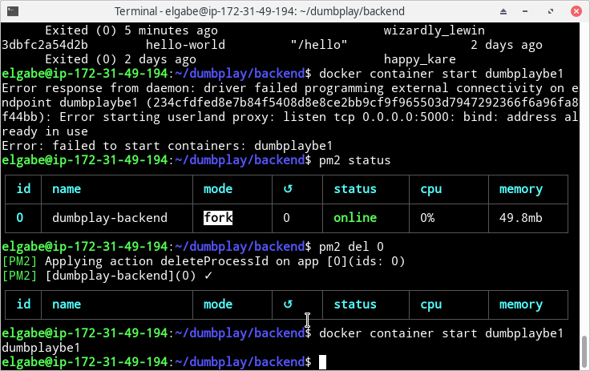
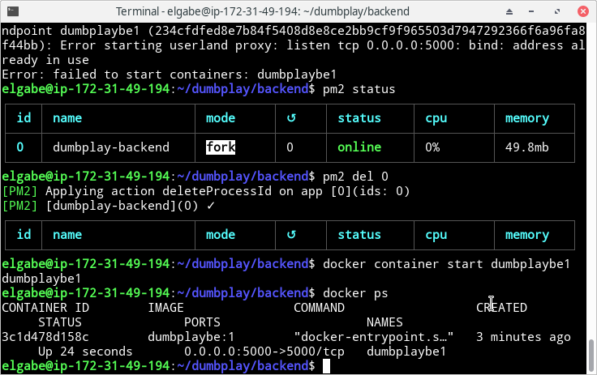
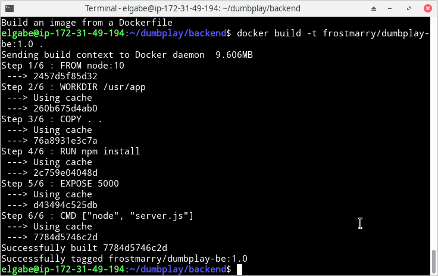
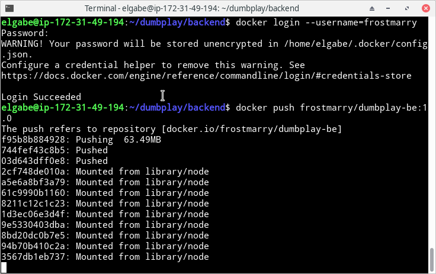

# CREATE DOCKER IMAGE

- Membuat Dockerfile dengan isi sebagai berikut



- Build dengan perintah sebagai berikut

```
docker build -t namaimage:tag .
```



- Cek docker images yang sudah dibuild

```
docker images
```



- Membuat container dari image yang sudah ada

```
docker create --name namacontainer -p portlocal:portaplikasi namaimage:tag
docker container start namacontainer
```




NB: pastikan port tidak bentrok dengan aplikasi lain (dalam kasus saya bentrok dengan pm2)

- Cek jika container sudah berjalan dengan `docker ps`



- Untuk push image, buat image dengan format akundocker/namaimage:tag dan pastikan sudah login terlebih dahulu. lalu jalankan perintah 

```
docker push namaimage:tag
```




### Docker Hub saya:

[frostmarry/dumbplay-fe](https://hub.docker.com/repository/docker/frostmarry/dumbplay-fe)

[frostmarry/dumbplay-be](https://hub.docker.com/repository/docker/frostmarry/dumbplay-be)