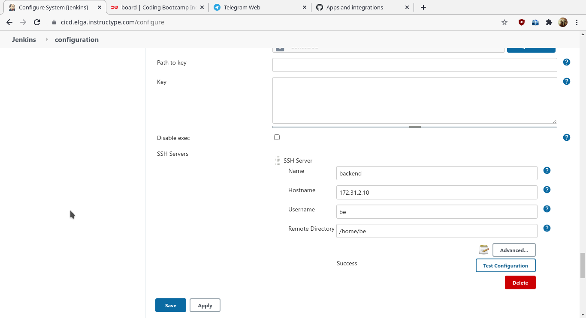

# CREATE JENKINS JOB

- Pertama yang saya lakukan adalah membuat token github agar bisa diakses oleh jenkins, token yang saya generate hanya membolehkan akses workflow repo dan read/write

- Token yang sudah dibuat ditambahkan pada konfigurasi guthub yang ada pada jenkins gui 

- Membuat jobs baru dengan menambahkan ssh repository github dan branch yang saya gunakan adalah master

- Credential yang digunakan untuk mengakses github menggunakan ssh key server yang ingin dihubungkan

- Menambahkan informasi server remote yang ingin dihubungkan dengan publish over ssh. Pada kasus ini, saya tidak menggunakan ssh key dan mencoba menggunakan password server, hasilnya pun sama saja.

- Pengaturan build menggunakan publish over ssh, nama didapat dari proses sebelumnya yang sudah berhasil konek ke remote server. untuk remote directorynya pastikan sudah masuk /home/user dan exec command berisi perintah yang akan dijalankan pada server remote

Untuk build saya lakukan setelah terjadi perubahan pada repo github

- Cek log github yang ada pada gui jenkins

- Consol log dari server yang terhubung dengan jenkins. Lingkaran berubah warna menjadi biru jika proses berhasil 

- Untuk push image ke docker saya menggunakan fitur yang sudah disediakan oleh docker, yaitu docker build yang terintegrasi dengan akun github, jadi docker akan secara otomatis melakukan build dan push setelah ada perubahan pada repo github.

- Setelah proses build berhasil akan ada keterangan kapan proses selesai dan di push, dipojok kanan bawah ada keterangan siapa yang melakukan build

