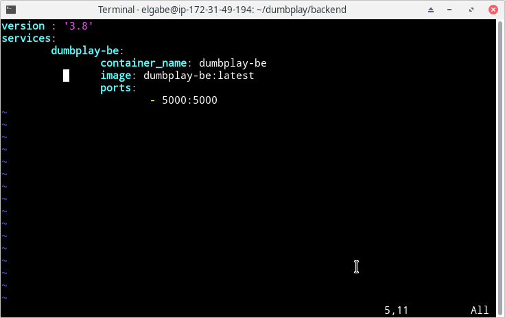
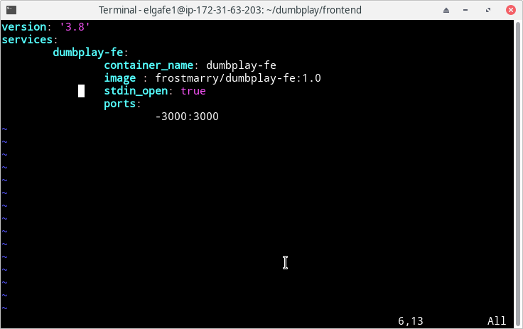
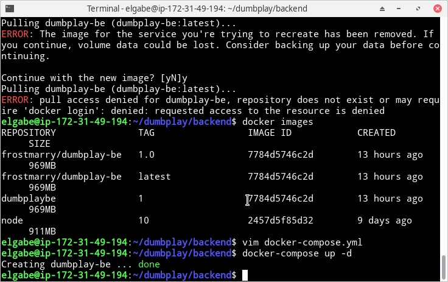
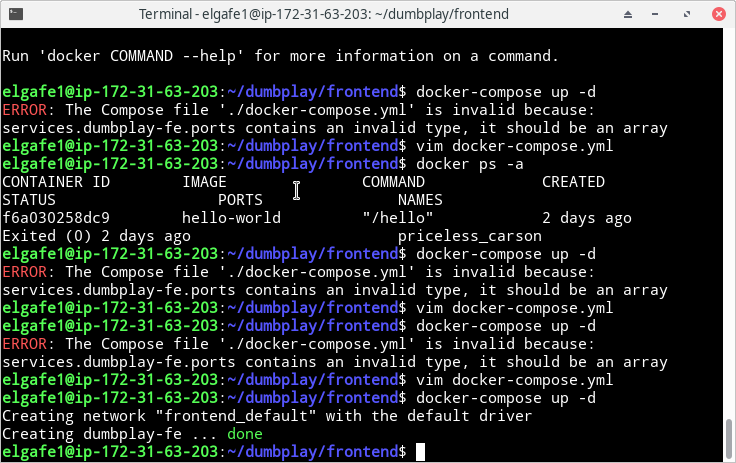
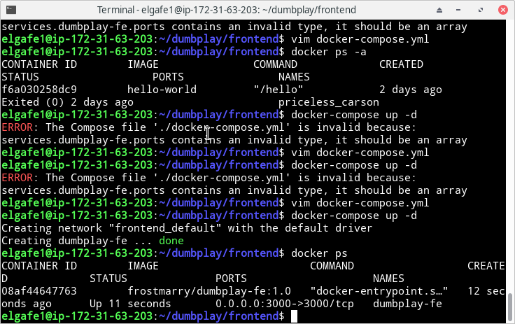

# INSTALL APPLICATION

- Membuat file `docker-compose.yml` dengan isi seperti berikut

Untuk backend:




Untuk frontend:



- Menjalankan docker compose dengan perintah 

```
docker-compose up -d
```

backend:




frontend:



- Cek pada di docker compose

