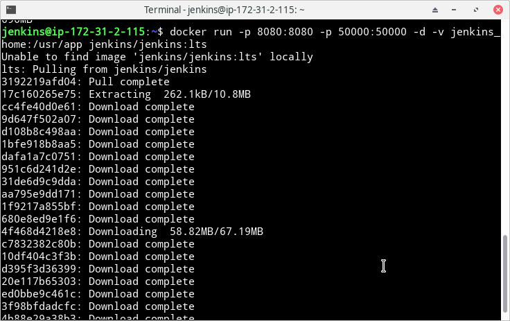
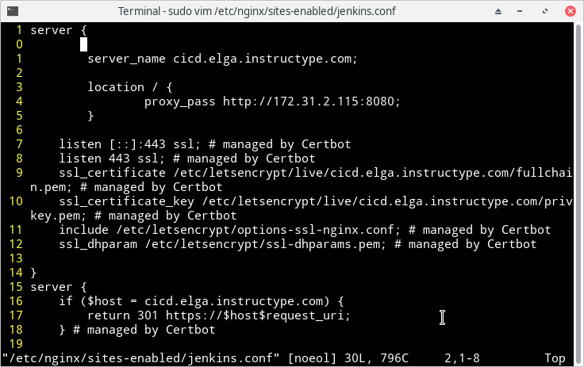

# INSTALL JENKINS

- Menginstall jenkins dari docker dengan menjalankan perintah

```
docker run -p 8080:8080 -p 50000:50000 -d -v jenkins_home:/usr/app jenkins/jenkins:lts
```

docker akan secara otomatis mendownload jenkins yang ada pada docker hub

Keterangan: 
	- digunakan port 8080 untuk akses gui jenkins dan 50000 untuk jenkins master/slave
	- perintah -v untuk membuat volume jenkins yang ada pada directory jenkins_home
	- saya gunakan versi jenkins lts karna lebih stabil



- Reverse proxy untuk jenkins gui



untuk proses instalasi saya langsung pilih konfigurasi standar dan tambahan install plugin github, discord bot dan publish over ssh


## TAMBAHAN

Untuk mendapatkan internet pada semua server saya menggunakan NAT Instance. Jadi server NAT terhubung dengan ip public subnet dan routing terhubung dengan internet gateway, sedangkan server lain yang butuh internet terhubung dengan server NAT pada routing dan menggunakan ip private subnet