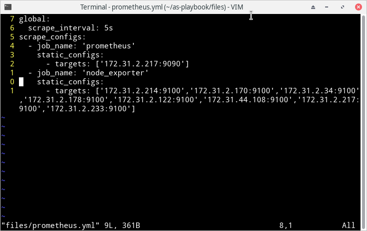
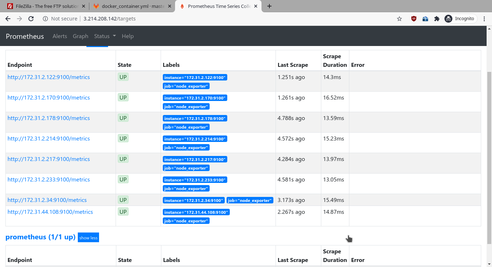
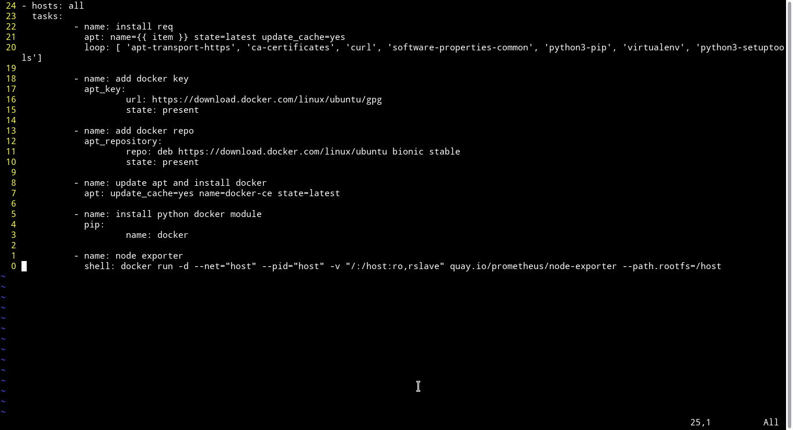
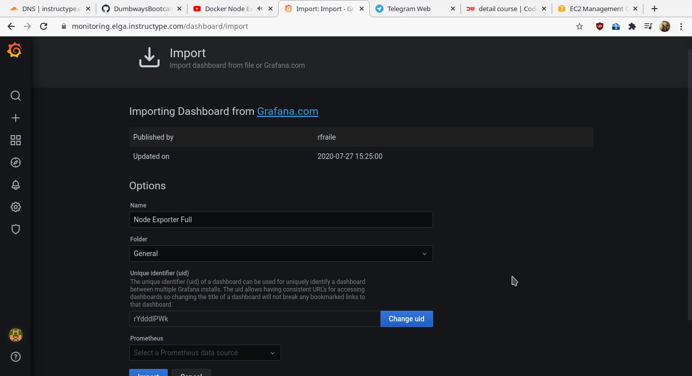
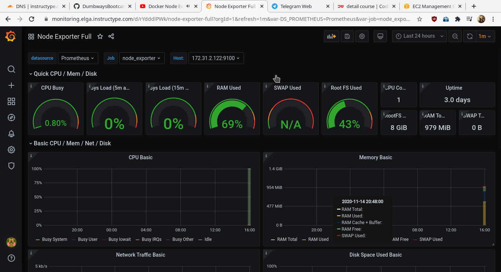

# CONNECT MULTIPLE SERVER TO PROMETHEUS

- Menambahkan konfigurasi prometheus untuk mendapatkan informasi dari server yang akan dipantau. File bernama `prometheus.yml` akan dimasukkan kedalam folder /etc/prometheus yang sudah dilakukan pada proses instalasi prometheus seperti sebelumnya. berikut isi dari konfigurasi prometheus dan tampilan website prometheus yang diakses dari komputer lokal:

- Cara prometheus mendapatkan data dari server yang lain adalah dengan meminta informasi node expoter yang sudah terinstall pada server remote. Proses instalasi node expoter juga dilakukan secara masal dan otomatis menggunakan ansible-playbook bersamaan dengan proses instalasi docker karena melibatkan semua server, jadi bisa dirasa lebih menghemat waktu. 

NB: untuk hasil run tidak sempat diambil karena proses yang cukup panjang dan melibatkan semua server

- Setelah prometheus berhasil mendapatkan semua data dari server remote giliran grafana yang akan di reverse proxy pada file monitoring.conf, jadi domain https://monitoring.elga.instructype.com yang sebelumnya menampilkan halaman prometheus akan diubah menjadi grafana supaya tampilan lebih enak dilihat dan informasi lebih jelas. Grafana akan mengambil data source dari prometheus dan menampilkan informasi berdasarkan host yang dipilih.

