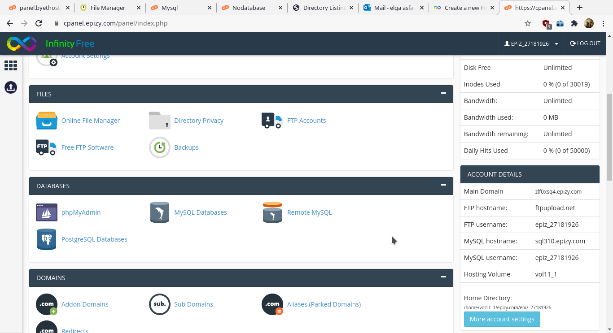
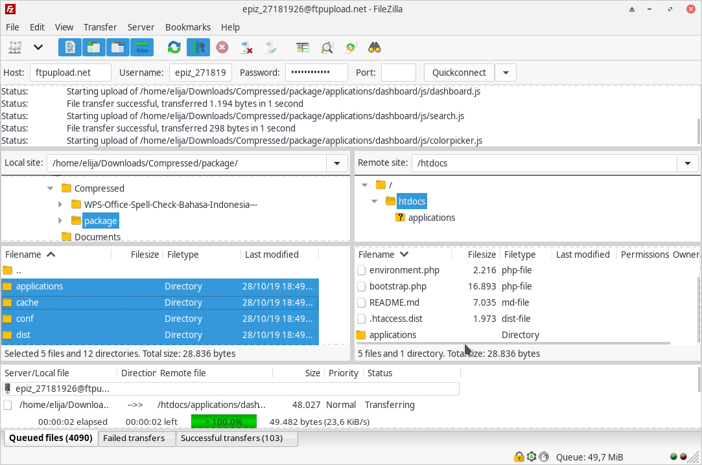
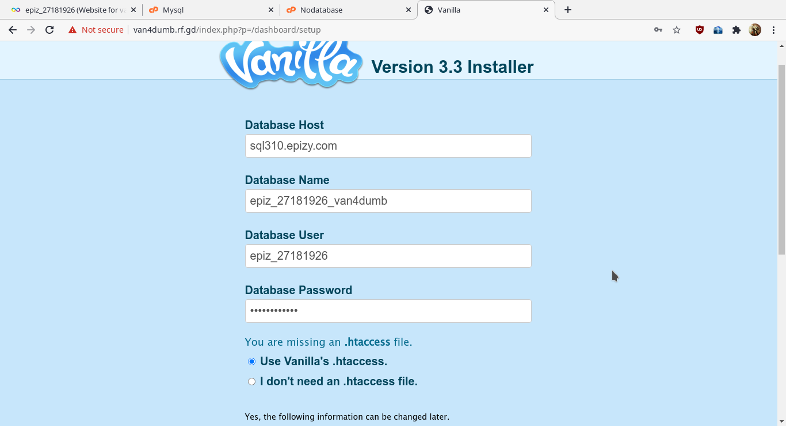
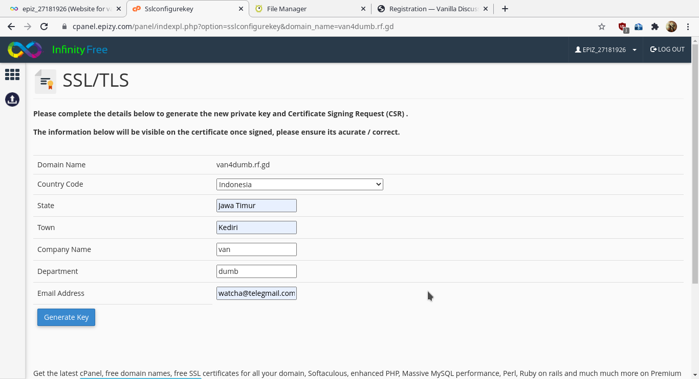
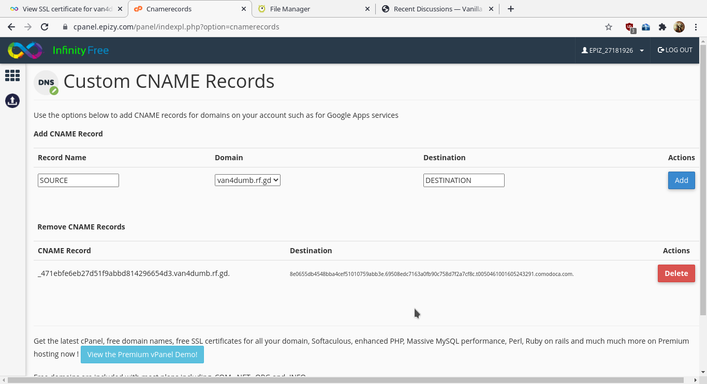
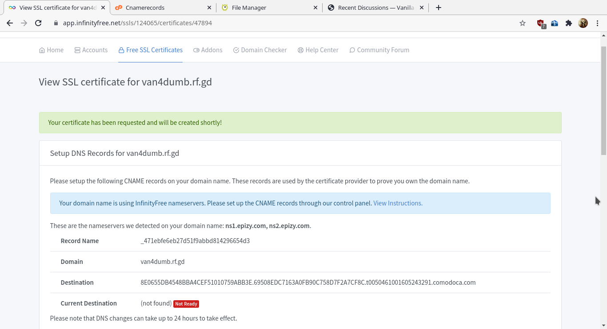
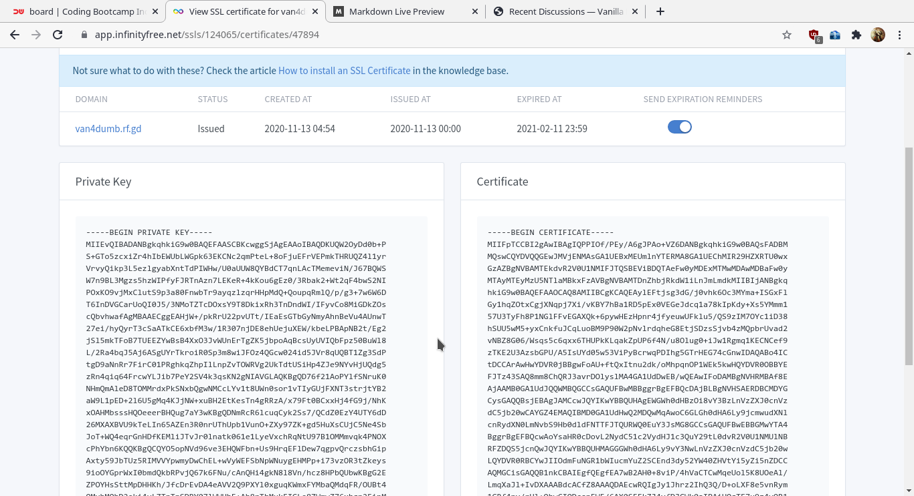
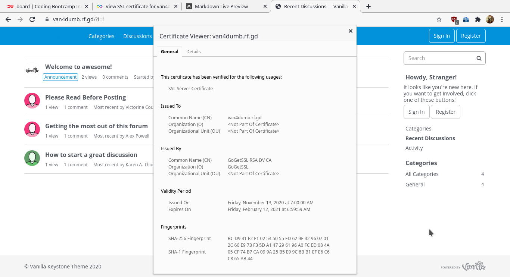

# DEPLOY PHP APPLICATION IN CPANEL

## Berikut beberapa platform yang saya gunakan untuk deploy php application:

#### CMS yang akan dideploy adalah [Vanilla Forum](https://vanillaforums.com/)
#### cPanel  yang digunakan adalah [Infinity free](https://infinityfree.net/)
#### SSL yang dipakai adalah [GoGetSSL](https://www.gogetssl.com/)
#### FTP yang digunakan adalah [FileZilla](https://filezilla-project.org/)
#### Domain cPanel saya adalah [van4dumb](https://van4dumb.rf.gd/)

Langkah - langkah yang dilakukan untuk deploy aplikasi pada cPanel adalah sebagai berikut: 

- Download cms yang akan dideploy, dan ekstrak pada komputer lokal agar mempercepat proses deploy sehingga tidak perlu ekstrak didalam folder cPanel

- Daftar ke cPanel dan pilih domain dan subdomain yang akan dipakai untuk mengakses CMS, pada kolom yang ada dikanan terdapat info yang bisa digunakan untuk mengakses ftp dan database

- Transfer cms yang sudah di ekstrak pada komputer lokal ke folder cPanel, bisa langsung dari website atau menggunakan ftp. Utuk kasus ini karena file cms Vanilla Forum ada lebih dari 4.000 file, menggunakan website akan membebani komputer lokal dan proses akan sangat lama, karnanya menggunakan frp adalah jalan keluar terbaik karna dirasa lebih ringan dan proses cukup cepat.

- Install CMS melalui domain yang sudah dibuat saat proses registrasi cPanel dan masukan data yang sudah didapat

- Pada cPanel infinityfree sudah disediakan **SSl Gratis** yang berlaku selama 60 hari dan bisa diperbaharui. Untuk mendapatkan ssl cukup mengisi data yang dibutuhkan dan tunggu sampai proses selesai.

- Setelah proses selesai, akan mendapat private key dan certificate yang bisa dimasukkan dalam menu SSL pada dashboard cPanel dan website dapat diakses menggunakan https://

