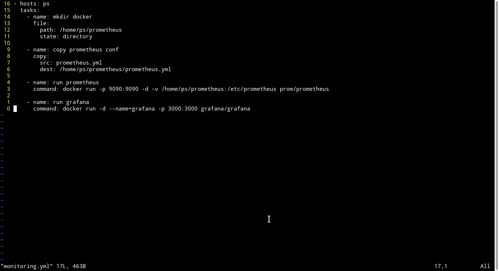
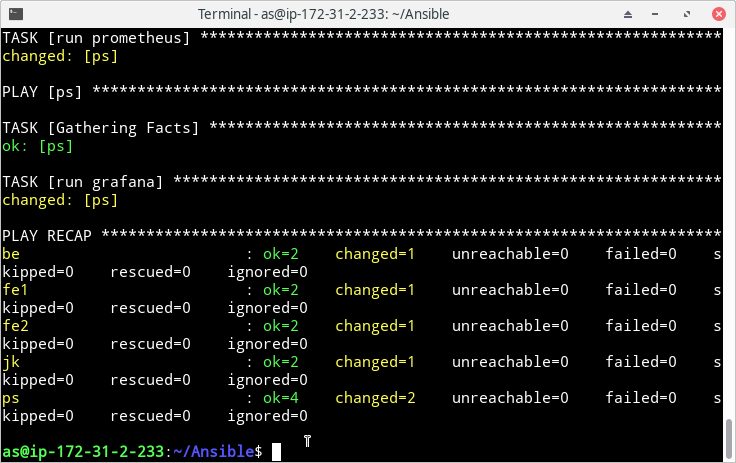
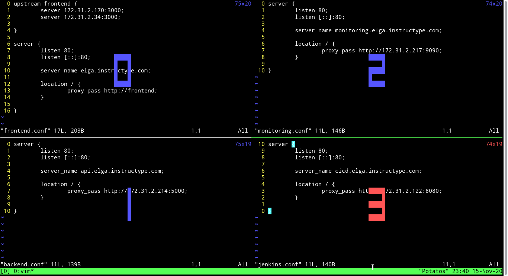
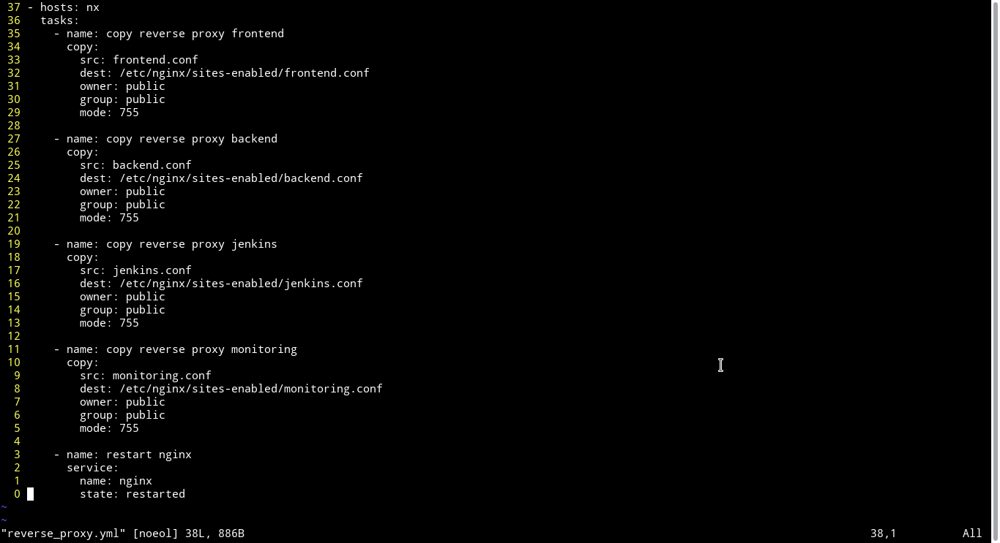
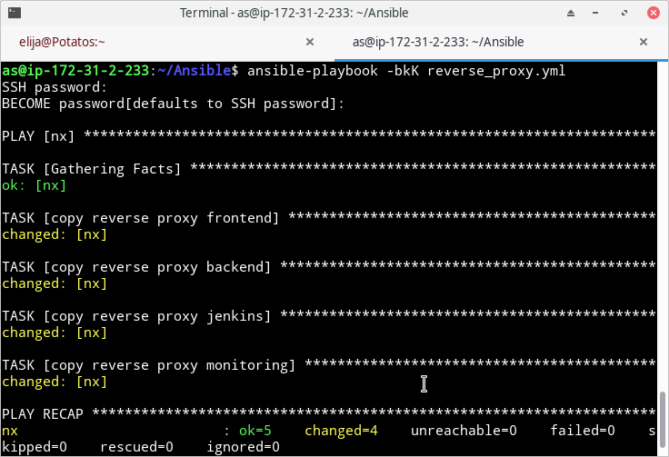
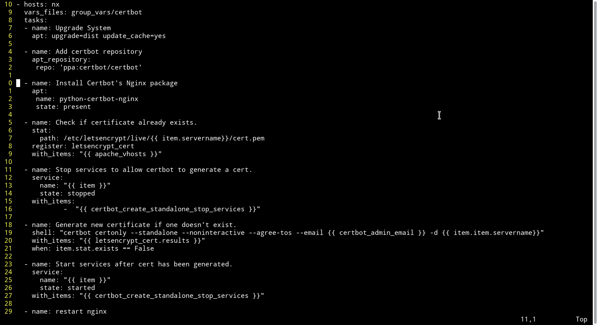
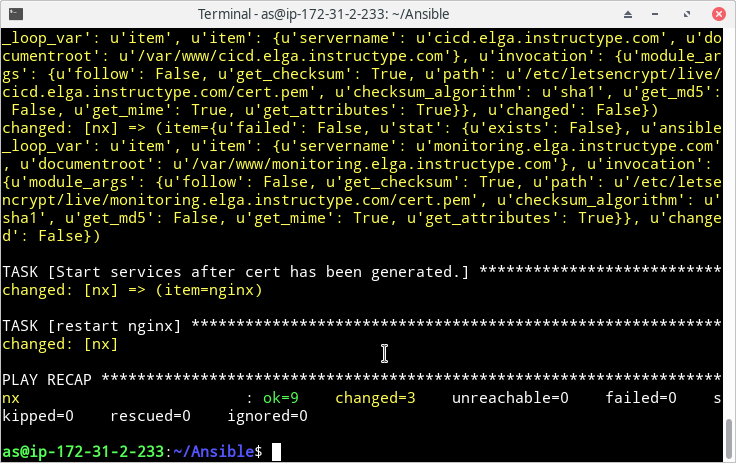

# SETUP MONITORING SERVER

- Install prometheus dan grafana pada server monitoring menggunakan docker yang dijalankan oleh ansible-playbook, berikut konfigurasinya dan hasil runing:

- Membuat reverse proxy untuk server frontend(0), grafana(1), backend(2), dan jenkins(3). lalu copy semua file yang sudah dibuat ke server nginx menggunakan ansible-playbook. 

- Untuk SSL lets encrypt digunakan bantuan certbot yang dijalankan melalui ansible-playbook dengan konfigurasi sebagai berikut

