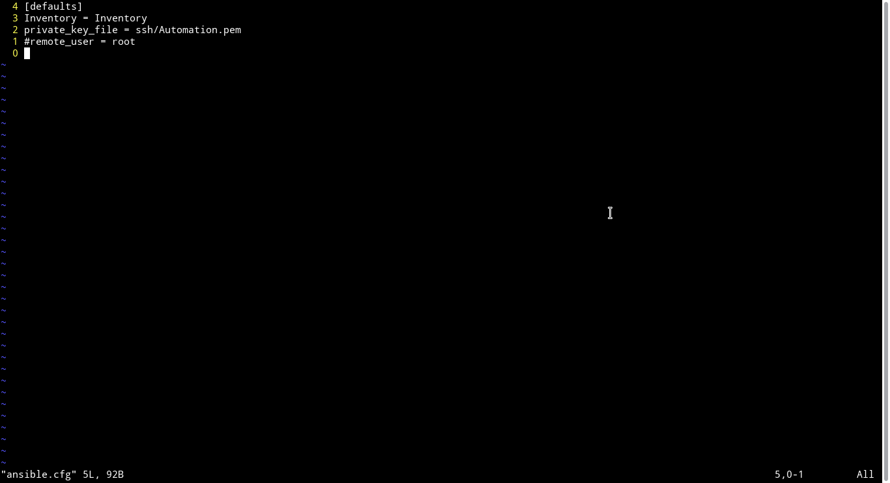

# SETUP SERVER WITH ANSIBLE

- Install ansible secara manual tanpa bantuan docker
```
apt install python
sudo apt-add-repository ppa:ansible/ansible
update and install
apt update
apt install ansible
```

- Setelah ansible terinstal, buat list inventory yang berisikan informasi host server remote

NB: pada awalnya ansible_user tidak ada dan untuk melakukan ssh ke server remote ansible menggunakan user root dan ssh keys yang ada pada file `ansible.cfg` berikut


- Membuat user dan group baru pada server remote menggunakan ansible-playbook. Beberapa hal yang perlu diperhatikan saat membuat user adalah password haruslah terenkripsi, untuk mendapatkan password yang sudah terenkripsi saya menggunakan bantuan `mkpasswd` dengan metode sha-512, selain password shell/terminal juga harus di deklarasikan agar dapat menggunakan terminal original ubuntu. setalah semua user berhasil dibuat, ubah PasswordAuthentication dar no ke yes, yang ada pada file `sshd_config` directory `/etc/ssh` agar user baru dapat digunakan untuk login menggunakan password, setelah itu restart sshd.


- Install NGINX pada server public dengan bantuan ansible-playbook.


- Setelah beberapa proses diatas, saya juga melakukan beebrapa eksperimen seperti generate ssh keys, instalasi mysql dan melakukan git clone menggunakan ansible-playbook

Proses generate ssh keys:


Proses clone repository private menggunakan ssh:


NB: Untuk menambahkan ssh key ke github masih dilakukan secara manual 


Proses instalasi mysql:


- Run docker untuk mengambil data dumbplay backend dan frontend, sehingga tidak perlu melakukan npm install maupun migrasi database. Serta mengambil data jenkins yang akan digunakan untuk melakukan build secara otomatis. Untuk proses instalasi jenkins sama persis dengan [minggu ke tiga](../../dumbweek3), hanya saja berbeda dalam proses otomatisasi dimana pada task ini dilakukan scheduling agar server tidak terbebani oleh proses build berulang kali.
